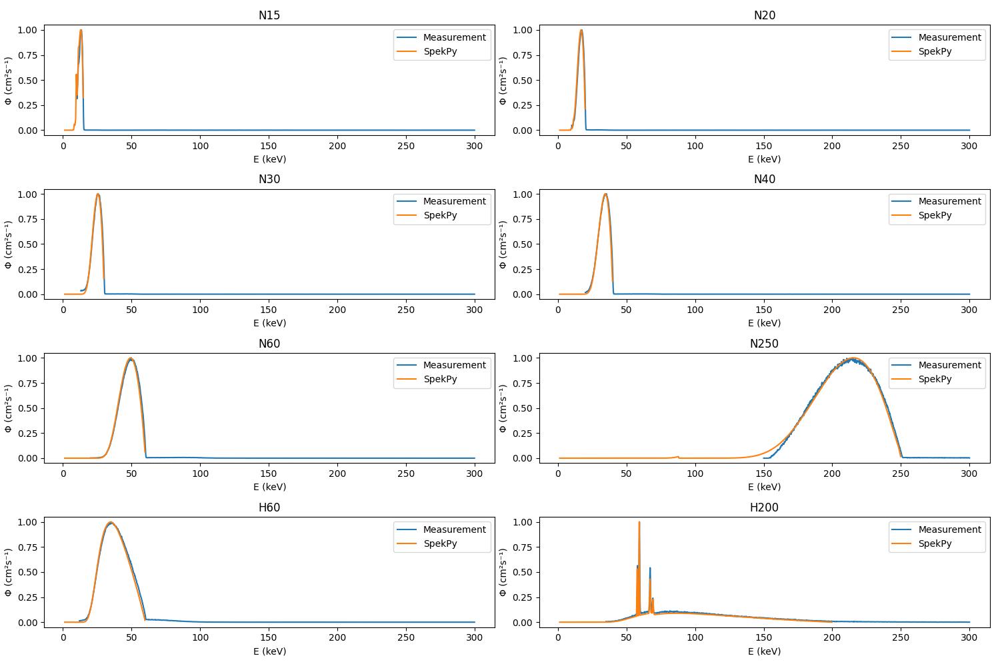

# xray-spectrometry-analysis

Analysis of experimental spectra for GuideRadPROS project

X-ray qualities chosen for the project:
N15, N20, N30, N40, N60, N250, H60, H200

## Comparing x-ray spectra

The next Figure shows x-ray spectra for the selected qualities obtained by spectrometry measurements and calculated by SpekPy.
Each spectrum is normalized using the maximum fluence value to ease the comparison of their shapes.
They seem fine.
We note that all measured spectra have long tails up to 300 keV.

Figure 1: Comparison of spectra for the selected qualities obtainted by spectrometry measurements and by SpekPy

## Comparing mean energy of x-ray spectra

First we compute the mean energy for the unfiltered measured spectra.
We compare it with values provided by SpekPy and ISO 4037-1 Table 1.
The results are shown in Table 1.
We observe big differences with SpekPy and ISO values, specially for low energies.

As show in Figure 1, all measured spectra have long tails up to 300 keV. 
So we would like to filter out non-relevant values from these tails.
We choose as criterion to filter out all the values above the energy corresponding with the peak kV.
Results are show in Table 2.
Applying this criterion differences falls below 2% with ISO and below 3% with SpekPy.

|      |   Measurements |   SpekPy |   ISO |   Measurements vs. ISO |   Measurements vs. SpekPy |   SpekPy vs. ISO |
|:-----|---------------:|---------:|------:|-----------------------:|--------------------------:|-----------------:|
| N15  |         14.899 |   12.274 |  12.4 |                -20.15  |                   -21.388 |            1.019 |
| N20  |         17.248 |   16.168 |  16.3 |                 -5.816 |                    -6.677 |            0.807 |
| N30  |         25.365 |   24.484 |  24.6 |                 -3.11  |                    -3.598 |            0.471 |
| N40  |         34.108 |   33.104 |  33.3 |                 -2.426 |                    -3.034 |            0.59  |
| N60  |         48.859 |   47.633 |  47.9 |                 -2.003 |                    -2.575 |            0.557 |
| N250 |        209.297 |  207.445 | 207   |                 -1.109 |                    -0.893 |           -0.215 |
| H60  |         39.222 |   37.753 |  38   |                 -3.215 |                    -3.891 |            0.651 |
| H200 |        101.767 |   98.469 |  99.3 |                 -2.484 |                    -3.349 |            0.837 |
Table 1: Mean energies using unfiltered measured spectra

|      |   Measurements |   SpekPy |   ISO |   Measurements vs. ISO |   Measurements vs. SpekPy |   SpekPy vs. ISO |
|:-----|---------------:|---------:|------:|-----------------------:|--------------------------:|-----------------:|
| N15  |         12.632 |   12.274 |  12.4 |                 -1.87  |                    -2.919 |            1.019 |
| N20  |         16.431 |   16.168 |  16.3 |                 -0.802 |                    -1.622 |            0.807 |
| N30  |         24.51  |   24.484 |  24.6 |                  0.367 |                    -0.104 |            0.471 |
| N40  |         33.17  |   33.104 |  33.3 |                  0.39  |                    -0.201 |            0.59  |
| N60  |         48.059 |   47.633 |  47.9 |                 -0.333 |                    -0.895 |            0.557 |
| N250 |        209.021 |  207.445 | 207   |                 -0.976 |                    -0.76  |           -0.215 |
| H60  |         38.263 |   37.753 |  38   |                 -0.691 |                    -1.351 |            0.651 |
| H200 |         98.271 |   98.469 |  99.3 |                  1.036 |                     0.201 |            0.837 |
Table 2: Mean energies filtering out values over peak kV in measured spectra

